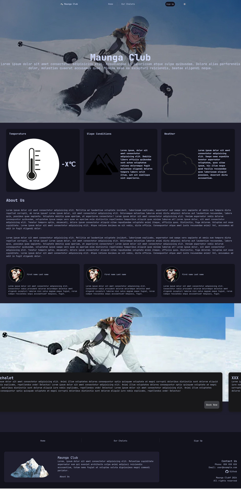
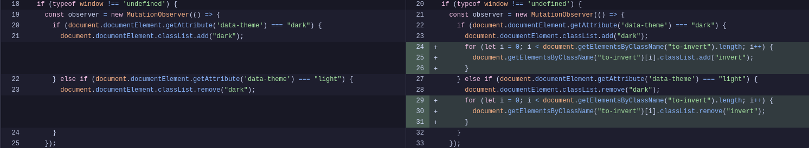
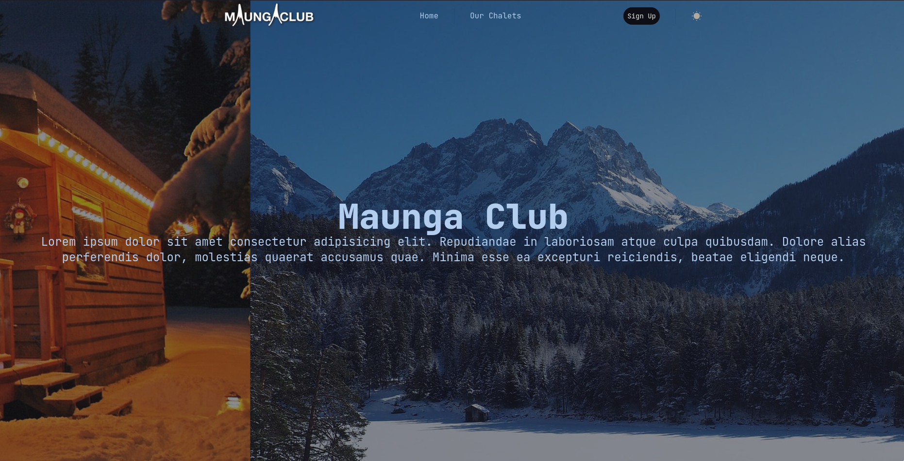
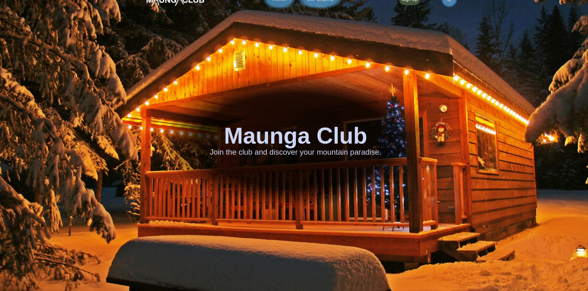
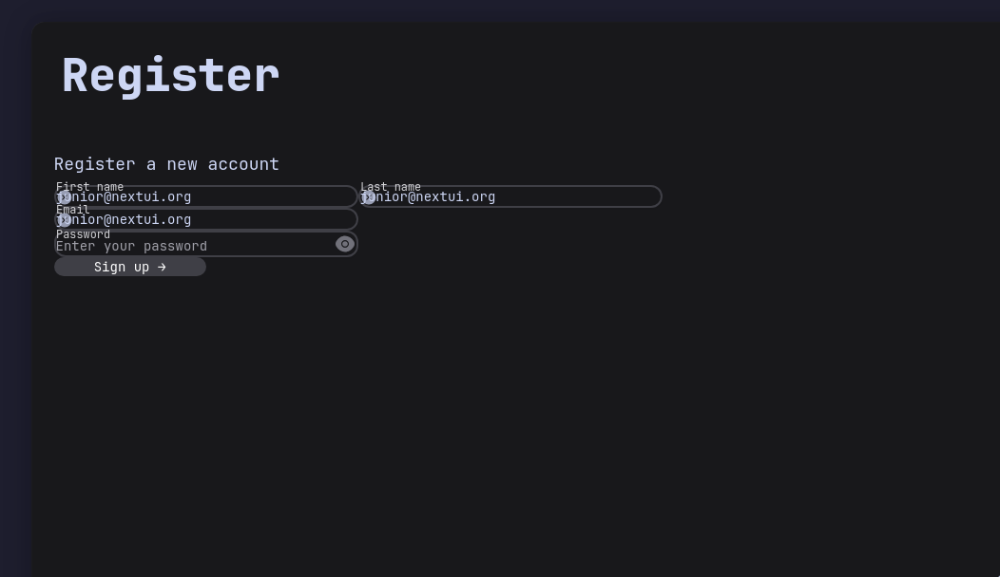
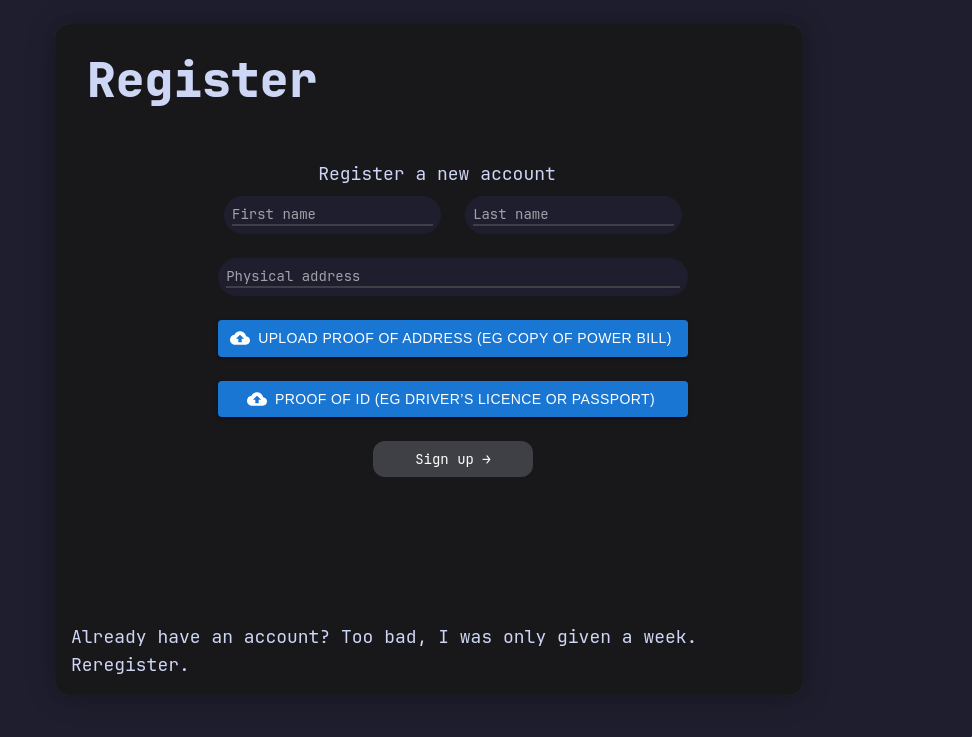
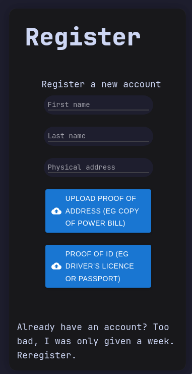
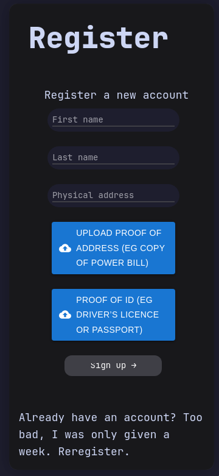

# Maunga Club Chalet Booking Website

To visit, go to: [maunga-club.vercel.app](https://maunga-club.vercel.app)

To request features, suggestions or report bugs, please use the [GitHub issues](https://github.com/sonicpanther101/nextjs-website/issues)

To run the site locally in development mode:
1. [Download](https://github.com/sonicpanther101/school-website/archive/refs/heads/main.zip) or clone the repository: `git clone https://github.com/sonicpanther101/school-website.git`
2. Navigate to the `school-website` directory in the terminal
3. Run `npm install`
4. Run `npm run dev`
5. Open http://localhost:3000 in your browser

Most of my work is in the files that I coded from scratch, and that were not generated by modules:
- [/layouts/head.tsx](https://github.com/sonicpanther101/school-website/blob/main/layouts/head.tsx)
- [/layouts/footer.tsx](https://github.com/sonicpanther101/school-website/blob/main/layouts/footer.tsx)
- [/pages/index.tsx](https://github.com/sonicpanther101/school-website/blob/main/pages/index.tsx)
- [/pages/chalets/index.tsx](https://github.com/sonicpanther101/school-website/blob/main/pages/chalets/index.tsx)
- [/pages/register/index.tsx](https://github.com/sonicpanther101/school-website/blob/main/pages/register/index.tsx)

## Achieved Criteria

### Purpose of the outcome

The purpose of this website is to make a booking system for Maunga Club chalets that allows users to book chalets in a functional, aesthetically pleasing and user-friendly way.

### Requirements of end users

The end users of this website are ultimately Maunga Club members or people looking to join. Because of this, I need to make it easy to use and aesthetically pleasing for new users and for existing users I need it to be consistent and convenient.

### Explanation of implications relevant to this website

Because of the requirements of this website, the relevant implications for this website are:

- The website should be aesthetically pleasing to draw in new users.
- The website should be user-friendly and easy to use so that users do not have to spend too much time on the website to find what they need and not be frustrated with the website.
- The website should be consistent and convenient so that users do not have to spend much time on the website to find what they need if they already know what they need.

Because of general requirements for all websites in the industry, other relevant implications for this website are:

- Intellectual property needs to be taken into account when designing the website to avoid infringing on any of the rights of third parties.
- When making the website, I need to make sure that it does not infringe on any legal rights.
- When making the website, I need to take into account privacy and confidentiality.
- The website should be sustainable and future-proof so that it can be easily maintained in the future.

### Demonstration of using tools, techniques and conventions that are appropriate for the purpose and end users of the website

I have demonstrated use of tools appropriate for the purpose of the website by using the following tools:

- [Next.js](https://nextjs.org), used to build the website.
- [React](https://reactjs.org), used to build the website.
- [Vercel](https://vercel.com/), used to deploy the website.
- [Tailwind CSS](https://tailwindcss.com), used to style the website in an efficient way.
- [Tailwind Variants](https://tailwind-variants.org), used to have multiple style schemes in the website, including dark mode.
- [Framer Motion](https://framer.com/motion), used to animate the website.
- [Eslint](https://eslint.org), used to lint (Code linting is the process of analysing source code for potential errors, warnings, and best practice violations to improve code quality and readability.) the code.
- [Prettier](https://prettier.io), used to format the code.
- [TypeScript](https://typescriptlang.org), a type safe version of JavaScript, used to write the code.
- [NextUI](https://nextui.org), used to style the website with pre-built components.
- [Embla Carousel](https://embla-carousel.com), used to create a carousel with pre-built components.

I have demonstrated use of techniques appropriate for the purpose of the website by using flex boxes to align elements in an aesthetic way.
Also by using media queries to make the website responsive by using md: before styles that should only apply to the website when on a landscape view. More info about md: [here](https://tailwindcss.com/docs/responsive-design).

I have demonstrated use of conventions appropriate for the purpose of the website by using the following conventions:

- The use of CSS flexbox to align elements in an aesthetic way.
- Because it is a website to be used for a company, it should use the industry standard software such as using Next.js, React and Vercel to build and deploy the website in an efficient way.
- The use of footer, header and navbar to follow the HTML semantics conventions.

## Merit Criteria

### Demonstrations of using conventions to improve the quality of the website include:

- Search for all uses of flex in the project 
- Search for all uses of [responsive media techniques](https://tailwindcss.com/docs/responsive-design) in the project 
- Proof of the use of Vercel to deploy the website 
- Proof of the use of Tailwind CSS to style the website (Tailwind CSS is the CSS-like classes each element has) 
- Proof of the use of HTML semantics in the website 
- Evidence of getting feedback from end-users and using this feedback to improve the website design  [Github - Issues](https://github.com/sonicpanther101/school-website/issues?q=is%3Aissue+is%3Aclosed)
- Using the popular [Catppuccin theme](https://github.com/catppuccin/catppuccin) to style the website 

### Evidence of using information I gathered from TESTING to improve the quality of the website

When testing the website with a screen reader, I found that many images did not have alt text. I then added explanatory alt text to all images.

When going through my site near the end of the coding process, I found that a few of the buttons did not work as expected. I then added the correct href to all buttons. [Git Commit](https://github.com/sonicpanther101/school-website/commit/b42ecb3776fdacb07fb5f32059b2a5c8c864aff2)
 

When getting my dad to test the website, he found that the website had terrible contrast in certain areas, so he submitted an [issue report](https://github.com/sonicpanther101/school-website/issues/1)

I then fixed the contrast and closed the issue, using the industry standard github issues system. The part with a problem went from:

To:

When testing responsiveness, I found that the logo was cut off by the other side of the header and the details div had too much margin when viewed on a mobile device. I then reduced the margin of the details div and shrunk the logo a bit for mobile view only. Before:

After:

When testing using the given website ([https://validator.w3.org/](https://validator.w3.org/)), I found that it warns for "Trailing slash on void elements". In other words, it is bad practice to have an element like \<br/\>. So I then removed all trailing slashes. After testing this, I found that the website didn't load. I then added a trailing slash back to all void elements. This is a classic example of the phrase "If it ain't broke, don't fix it". Because it did not give me a detailed error, the only evidence is:

### Evidence of addressing relevant implications

I have addressed the implication of aesthetics by applying Catppuccin, a colour scheme specifically designed to be plain, simple and pleasing to the eye. However after talking with Mrs Searle, my stakeholder for this project, *after* the date of submission, she told me that my colour scheme was too plain. She recommended I add some more colour to the website to make it more inspiring and less bland. So I used [this tool](https://coolors.co/) to help me find colours for my new colour scheme. It was very good to be listening to music while choosing this, refreshing every beat/bar of the song. I was looking for colours that somewhat suited the theme of a ski chalet site, and I think I did a decent job at it. Also this was done at 3:30 AM, so excuse the mess of a thought train at the moment.
 
 
I have addressed the implication of user-friendliness by making sure that the website is easy to use and intuitive to use for both new and returning users through the use of flexboxes to well space elements and the use of common convention of websites, having intuitive navigation for everyone who has used a website before.
 
 
I have addressed the implication of consistency and convenience by making the website follow the common layout of websites, allowing for users to easily and quickly find what they need.
 
 
I have addressed the implication of intellectual property, legal rights by only using third-party content when necessary and by making the most of the images given. The few times I did use third-party content, I got it from [Pixabay](https://pixabay.com/) allowing me to use their images for my purpose because they are royalty free. Another thing that needs to be taken into account is that I have used the google font [JetBrains Mono](https://fonts.google.com/specimen/JetBrains+Mono) to style the website. Google fonts are all free for use in even commercial projects. 
 
After talking with Mrs Searle, my stakeholder for this project, *after* the date of submission, she told me that the JetBrains Mono font is not a pleasing font to look at because it is monospaced and looks old fashioned like a typewriter font. She recomended I just use a default font such as Roboto, so I changed the font to Roboto, which is another free google font that is much more pleasing to view.
 

 
I have addressed the implication of privacy and confidentiality by not sharing any personal information with third parties, keeping all data locally (in the browser) and not saving/taking any other information.
 
 
I have addressed the implication of sustainability and future-proof by using an upgradable framework and core component libraries that can be easily used in the future also with new technologies. Because one of the key things in sustainability is that it can be maintained in the future, code readability is key, this is why I have used plugins such as Prettier and Eslint as well as using the component libraries to simplify the code in the main files.

## Excellence Criteria

### Demonstration of using efficient tools and techniques when developing my website

I have used the default Next.js "pages" file structure. This means that all pages are created in a folder called "pages" and each page is created in a folder with the name of the page, eg. "pages/index.tsx" for the homepage and "pages/register/index.tsx" for the register page. This is key for having a logical and industry standard file structure.

I have added meaningful comments to my code by commenting to title the sections of my homepage.

And also by commenting on features that are not yet implemented.

I have used [https://validator.w3.org/](https://validator.w3.org/) to validate my website. When I ran it first, I found that it had a few errors.

I went ahead and fixed these errors however I cannot fix some because I am using Next.js, which means the code I write is not directly the html that ends up on the website. This means I don't have control over the compilation to get rid of these errors.

I have optimised my website by optimising the load method for images and other media by loading them after the page has loaded. This means that the website loads faster and is usable before the image is loaded. This might seem like it would be bad, however none of the images in the website are necessary for the website to work/be usable. This is good for people who have a slow connection and don't want to wait for the images to load, and can have them loaded in the background, invalidating the need for images to be compressed to a lower quality to load faster.

### Evidence of continually improving my website throughout the design, development and testing process

I have logged my continual improvements to my website throughout the design, development and testing process by using Github to save my work, showing each change made to the website at each step. You can find my work here: [Github - Commits](https://github.com/sonicpanther101/school-website/commits). By clicking on the commit, you can see the files that were changed.

When I was creating the homepage, I first made a *very* rough plan of the website in Aseprite.

I then went ahead and made the homepage to a decent quality (sorry for the rip in the screenshot).

After that I asked for feedback from Oli. He said that I should use higher quality images and remove the placeholder images, so I got the images from the google classroom and a few from [Pixabay](https://pixabay.com/) to avoid any legal concerns. You can find everything I changed from Oli's feedback here: [Github - Commits](https://github.com/sonicpanther101/school-website/commit/a94ad3619716569ee1c1d14ee447b56f22c7bbf4).

After that, I asked for feedback from my dad. He said that the pixabay images didn't have enough contrast when in dark mode. I hadn't noticed this because my monitor with which I was making the website had a very high contrast, so this was a good thing he noticed by using his phone and laptop. I had to search the tailwind CSS documentation to find how to invert the colours of an image, I found [this](https://tailwindcss.com/docs/invert). I then also needed to add some TypeScript to toggle the inverted colours.

You can find everything I changed from my dad's feedback here: [Github - Commits](https://github.com/sonicpanther101/school-website/commit/0bf1e906e7eadfe108428dd75aa6bc6cfb41c6bb) and you can find the log of this issue here: [Github - Issues](https://github.com/sonicpanther101/school-website/issues/1).

After getting feedback from Mrs Searle, my stakeholder for this project, *after* the date of submision, she said that the hero image on the landing page looked dull. 

This was because I was applying a filter to the image to increase it's contrast with the title. I then changed my filter to only apply in a range around my title text.

As you can see the hero image is much brighter now that the filter has been removed, while still retaining the contrast on the title. You can find everything I changed from Mrs Searle's feedback here: [Github - Commits](https://github.com/sonicpanther101/school-website/commit/8140e026e120d91b8ca94713ca6e0d19eb09fbd5) and you can find the log of this issue here: [Github - Issues](https://github.com/sonicpanther101/school-website/issues/6).

There were a lot more changes that I made to the website after feedback, but these are only the ones from the homepage that I have logged.

For the registration page, I got a rough plan of the page from the [Aceternity registration demo](https://ui.aceternity.com/components/signup-form).

I then used a mix of [Nextui inputs](https://nextui.org/docs/components/input) and [MUI file uploads](https://mui.com/material-ui/react-button/#file-upload) to create the pre-feedback registration page. 

After this I went and got some feedback from my dad, who was using his phone that has a different resolution to the ones I was testing earlier, and he said that the submit sign up button was hidden on his phone.

I then made the registration card have a larger height in mobile view by changing `h-[85vh] lg:h-[70vh]` to `h-[115vh] lg:h-[85vh]`. `h-` documentation: [Tailwind CSS - Height](https://tailwindcss.com/docs/height) and `ld:` documentation: [Tailwind CSS - Responsiveness](https://tailwindcss.com/docs/responsive-design). This change is a great example of why tailwind CSS is so powerful, because instead of:
- Finding the element that you want to change
- Finding and remember its class
- Going to the CSS file
- Finding the class that you want to change
- Finally change it
- Worry about other elements with the same class

You can just:
- Find the element that you want to change
- Change the class

You can find everything I changed from my dad's feedback here: [Github - Commits](https://github.com/sonicpanther101/school-website/commit/0bf1e906e7eadfe108428dd75aa6bc6cfb41c6bb) and you can find the log of this issue here: [Github - Issues](https://github.com/sonicpanther101/school-website/issues/2).

## Challenges

Having 3 weeks to make a website sounds like a lot of time. However, with the preliminary  exams in the middle of that time slot, I had very little time to work on the website in the first 2 weeks because I was studying hard for the exams. I worked on the header and footer of the website up until Tuesday of the final week, working at a normal pace. I realised it had to be done by Friday, and cranked up the hours, because when coding you can't code faster or slower, you just have to put more time into it. This allowed me to finish the majority of the website by Thursday, only having to stay up till 4AM twice to get there. Finally on friday, I started on the write up and found that it was only due on Sunday, which made me really mad. But this also made me proud of what I can do in such a short amount of time.

## Planning

 
 

 
 

## Licence

Licensed under the [MIT licence](https://github.com/sonicpanther101/school-website?tab=MIT-1-ov-file#).